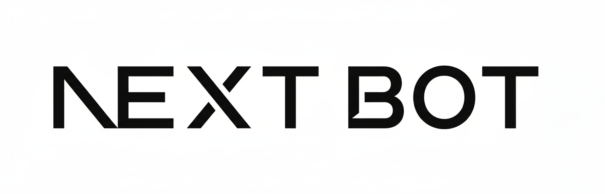

<h1 align="center">


NextBot
<br>
<h4 align="center">
一个基于 <a href="https://nonebot.dev/">NoneBot2</a> 的 Terraria <a href="https://github.com/Pryaxis/TShock">TShock</a> QQ 机器人
</h4>
</h1>

## 声明
本项目仅用于学习与技术交流，请勿用于非法用途。

## 关于本项目
`next-bot` 是一个基于 <a href="https://nonebot.dev/">NoneBot2</a> 的 Terraria <a href="https://github.com/Pryaxis/TShock">TShock</a> QQ 机器人

## 快速开始
1. 安装依赖（推荐使用 `uv`）
```bash
uv sync
```

2. 配置环境变量（`.env`）
```env
# NoneBot
LOG_LEVEL=INFO
DRIVER=~websockets
LOCALSTORE_USE_CWD=true
COMMAND_START=["/", ""]

# 访问控制（仅允许这些私聊/群消息）
OWNER_ID=["123456789","987654321"]
GROUP_ID=["123456789"]

# OneBot V11 反向 WS
ONEBOT_WS_URLS=["ws://127.0.0.1:3001"]
ONEBOT_ACCESS_TOKEN=your_token

# Web Server（控制台 + 渲染）
WEB_SERVER_HOST=127.0.0.1
WEB_SERVER_PORT=18081
WEB_SERVER_PUBLIC_BASE_URL=http://127.0.0.1:18081
# 控制台登录 token，不配置则启动时自动生成并打印
WEBUI_TOKEN=
# 控制台会话签名密钥，不配置则启动时自动生成
WEBUI_SESSION_SECRET=
# 命令关闭策略：reply(拦截并提示) / silent(静默忽略)
COMMAND_DISABLED_MODE=reply
# 命令关闭提示词（仅 COMMAND_DISABLED_MODE=reply 时生效）
COMMAND_DISABLED_MESSAGE=该命令暂时关闭

```

3. 启动机器人
```bash
uv run python bot.py 
```

4. 访问控制台
```text
http://127.0.0.1:18081/webui
```
首次访问会跳转到登录页，输入 `WEBUI_TOKEN` 即可进入控制台。

5. 命令配置中心
```text
http://127.0.0.1:18081/webui/commands
```
可在页面中统一开关命令、修改参数并保存，保存后即时生效，无需重启。

## 关于许可证
本项目基于 AGPL v3.0 许可证授权发行，您可以在遵守许可证的前提下自由使用、复制、修改、发布和分发本项目。

有关 AGPL v3.0 许可证的详细信息，请参阅 https://www.gnu.org/licenses/agpl-3.0.html
