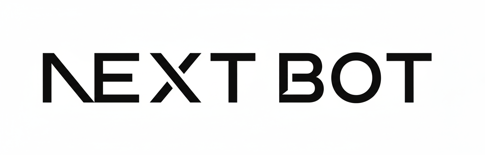

<h1 align="center">

NextBot
 
<h4 align="center">
一个基于 <a href="https://nonebot.dev/">NoneBot2</a> 的 Terraria <a href="https://github.com/Pryaxis/TShock">TShock</a> QQ 机器人
</h4>
</h1>

## 声明
本项目仅用于学习与技术交流，请勿用于非法用途。

## 关于本项目
NextBot 是一个基于 <a href="https://nonebot.dev/">NoneBot2</a> 的 Terraria <a href="https://github.com/Pryaxis/TShock">TShock</a> QQ 机器人

## 快速开始

按你的运行平台挑一个：

- **Windows** 小白向安装教程（含 TShock 插件、NapCat、NextBot 全流程）：[docs/windows_install.md](docs/windows_install.md)
- **Windows** 小白向视频安装教程：[Bilibili](https://b23.tv/eiU2zqO)
- **Linux / macOS（Docker）** 安装教程：[docs/docker_install.md](docs/docker_install.md)
  镜像发布在 GitHub Container Registry：`ghcr.io/arispex/nextbot:latest`（linux/amd64 + linux/arm64）

## 相关文档

- [权限与身份组机制](docs/permissions.md)（Owner / 用户独立权限 / 身份组继承的校验流程与管理方法）
- [NextBotAdapter 配置文件说明](https://github.com/Arispex/NextBotAdapter/blob/main/docs/CONFIGURATION.md)（TShock 适配插件的配置文件字段说明）

## 关于许可证
本项目基于 AGPL v3.0 许可证授权发行，您可以在遵守许可证的前提下自由使用、复制、修改、发布和分发本项目。

有关 AGPL v3.0 许可证的详细信息，请参阅 https://www.gnu.org/licenses/agpl-3.0.html
